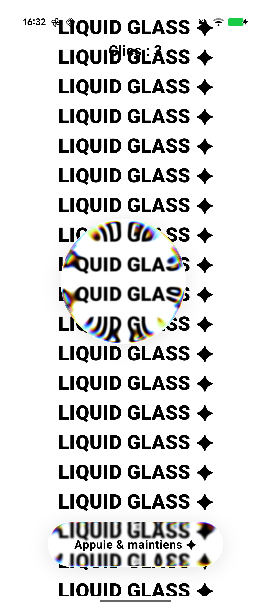

# Liquid Glass on Android

A small experiment to reproduce the iOS "Liquid Glass" material in Jetpack Compose:
a glass shape that refracts what's behind it, with a bit of chromatic dispersion at the
edges and an elastic press effect on a button.



## How it works

Android has no native equivalent of iOS Liquid Glass, so the refraction relies on the
[Kyant0 backdrop](https://github.com/Kyant0/AndroidLiquidGlass) library. The background is
captured as a "source", and the glass element renders that source through a `lens` effect
(AGSL shaders).

```kotlin
val backdrop = rememberLayerBackdrop()

// background captured as the source
Box(Modifier.layerBackdrop(backdrop).background(Color.White)) { /* content */ }

// glass element refracting the source
Box(Modifier.drawBackdrop(
    backdrop = backdrop,
    shape = { CircleShape },
    effects = {
        vibrancy()
        blur(1.dp.toPx())
        lens(28.dp.toPx(), 56.dp.toPx(), depthEffect = true, chromaticAberration = true)
    },
))
```

The button uses a spring animation on the press state to scale it down, which gives the
elastic feel.

## Requirements

- compileSdk 37
- Runs on Android 13+ (API 33), since the effect uses AGSL `RuntimeShader`.

## Credits

Refraction powered by [Kyant0/AndroidLiquidGlass](https://github.com/Kyant0/AndroidLiquidGlass).
